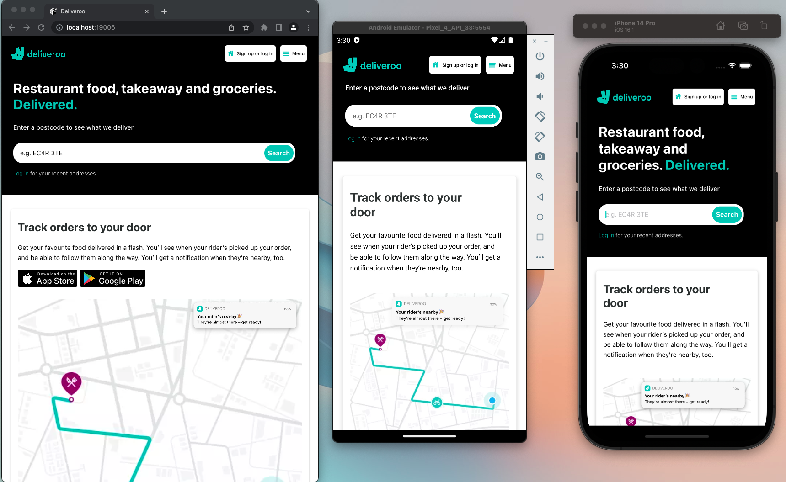

# React Native Deliveroo

Simple Expo app with the UI for the Deliveroo Homepage. Built using React Native.

## Cool Features

- Custom built `<DownloadButton>` component (Reusable for Apple & Google & Any other download type)
- Image layering using `<ImageBackground>` component from React Native.

## Install

- Clone the repository
- Run a `npm install`
- Run `npm run start` to run metro and then follow the terminal to run on iOS/Android/Web.

**Noticed a weird bug with node 18, so try and use 16 if you want to deploy to web**

## Screenshot

Below is the app running on Web/Android & iOS. Slight differences are shown between each platform, such as the install buttons not being present on Native mobile.

